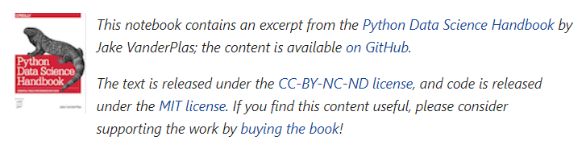

### License discussion

The choice of a license is an important selection when publicly releasing code and documentation.

It is important to note that negelecting to explicitly specify a license during release does not avoid the choice of license. By default,  copyrights are retained by the authors.
For example, code uploaded to GitHub without a license specified [retains default copyrights to the authors](https://docs.github.com/en/repositories/managing-your-repositorys-settings-and-features/customizing-your-repository/licensing-a-repository)  under [United States copright law](https://www.uspto.gov/ip-policy/copyright-policy/copyright-basics).


Specifying a license allows the authors of the code to control  how rights are deligated and what uses of the material are permissable.
Different license have a vareity of different advantages and disadvantages.
It is possible and may be desirable to license different components of a project under different licenses (e.g data, methods, reports)


#### Stanford Requirments

the [Stanford Office of Technology Licensing](https://otl.stanford.edu/software) provides the following guidance regarding open-source licensing:

```
Original software code falls under the rubric of copyrighted intellectual property.

The office provides three options for licensing code:

1. Software can be put in the public domain, i.e., copyright is not claimed and anyone can use the software for any purpose and without payment
2. Copyrighted software can be licensed (including through an open source license)
 to the academic community with or without payment, and with or without oth0er restrictions
3. Copyrighted software can be licensed (including through an open source license) 
to the commercial community with or without payment, and with or without other restrictions.

Note: "Open source is different from public domain. 
Copyrighted software can be licensed under an open source license.

To be licensable under any kind of license (including an open source license), 
Stanford must have clear copyright ownership to all portions of the software 
i.e., the software must contain code written only by creators who assign copyright to Stanford. 
It is responsibility of Stanford creators to ensure that Stanford has rights to software created at Stanford."
```


###


### Creative Commons

[Creative Commons](https://creativecommons.org/share-your-work/cclicenses/https://creativecommons.org/share-your-work/cclicenses/) reffers to  family of open-source licenses. 
Licenses, with varying levels of permissivness, allow the creator to specify permitted uses of the created work.

Creative commons additionaly provides [**CC0**](https://creativecommons.org/publicdomain/zero/1.0/legalcode.txt) - A public-domain license intened to allow use of a creative work, [including software](https://wiki.creativecommons.org/wiki/CC0_FAQ#May_I_apply_CC0_to_computer_software.3F_If_so.2C_is_there_a_recommended_implementation.3F), without restrictions. Attribution could [still be requested](https://wiki.creativecommons.org/wiki/CC0_FAQ#Does_CC0_require_others_who_use_my_work_to_give_me_attribution.3F), in accorance with professional standards.


This work by ASAPbio is licensed under a [Creative Commons Attribution 4.0 International](http://creativecommons.org/licenses/by/4.0/) license.



The [Python Data Science Handbook](https://jakevdp.github.io/PythonDataScienceHandbook/)
 is licensed under
[CC BY-NC-ND 3.0](https://creativecommons.org/licenses/by-nc-nd/3.0/us/legalcode),
requiring attribution before content may be used, restricting the content from being used commercially, and restricting the construction of derivative content without permission of the author.

[**CC0**](https://creativecommons.org/public-domain/cc0/) ("No rights reserved") refers to the Creative Commons license to release a work into the public domain.


### GPL

THe GNU [General Public License](https://www.gnu.org/licenses/gpl-3.0.en.html) is an open source license designed for free software.

The open source image editor [GIMP](https://www.gimp.org/) is released under the [GPL license](https://gitlab.gnome.org/GNOME/gimp/-/blob/master/LICENSE).

### Unlicense

The [Unlicense]() is a short standardized way to dedicate a creative work into the public domain.


[youtube-dl](https://github.com/ytdl-org/youtube-dl) is a command line tool for downloading videos from [Youtube](youtube.com), released into the public domain using the [Unlicense](https://github.com/ytdl-org/youtube-dl/blob/master/LICENSE).

